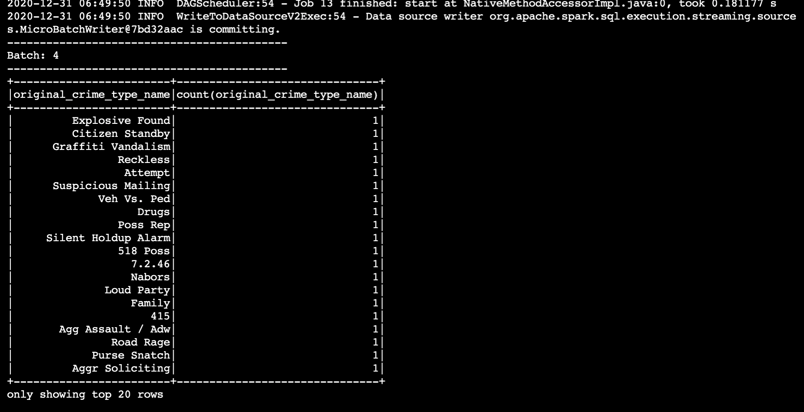
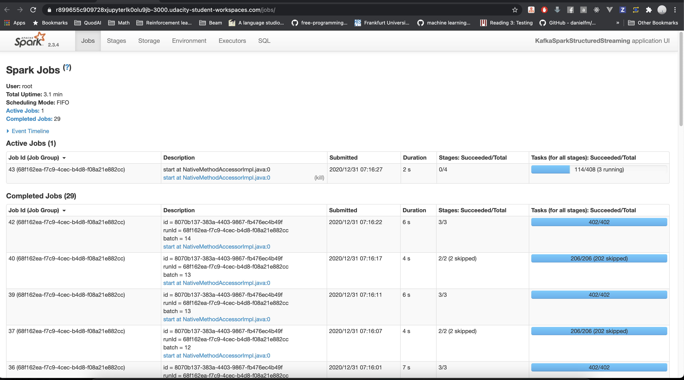

# SF Crime Statistics with Spark Streaming

### Kafka Consumer Console Output

### Spark Console Output

### Spark UI

## Answer questions 

### How did changing values on the SparkSession property parameters affect the throughput and latency of the data?

It affects `processedRowsPerSecond` , which is the rate at which Spark is processing data

### What were the 2-3 most efficient SparkSession property key/value pairs? 

The most efficient values are

- spark.sql.shuffle.partitions=2
- spark.streaming.kafka.maxRatePerPartition=10
- spark.default.parallelism=100

### Through testing multiple variations on values, how can you tell these were the most optimal?

I tested by running with different sets of values for those configs and compare which set of values give the highest `processedRowsPerSecond`

